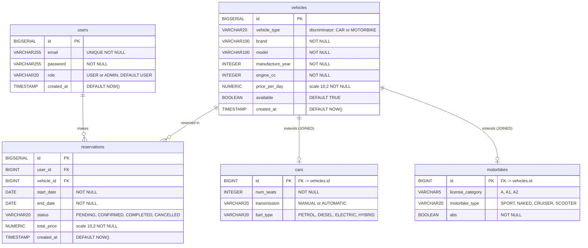
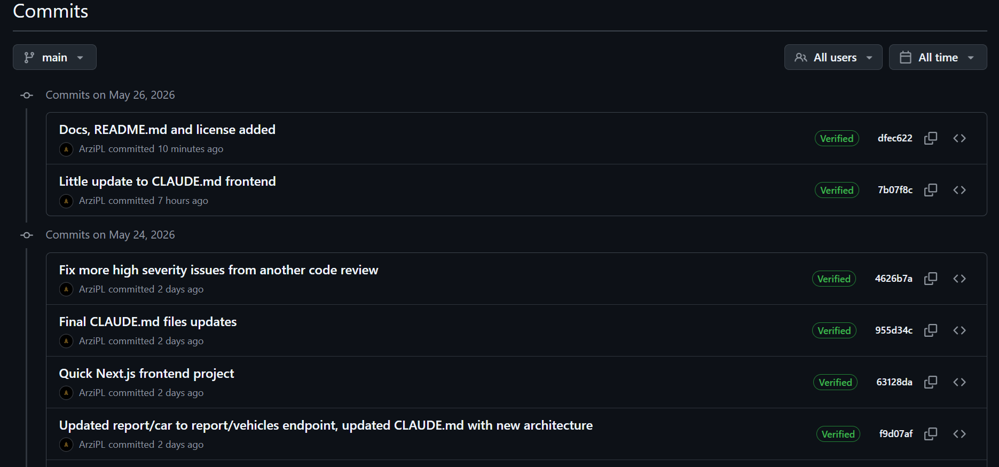
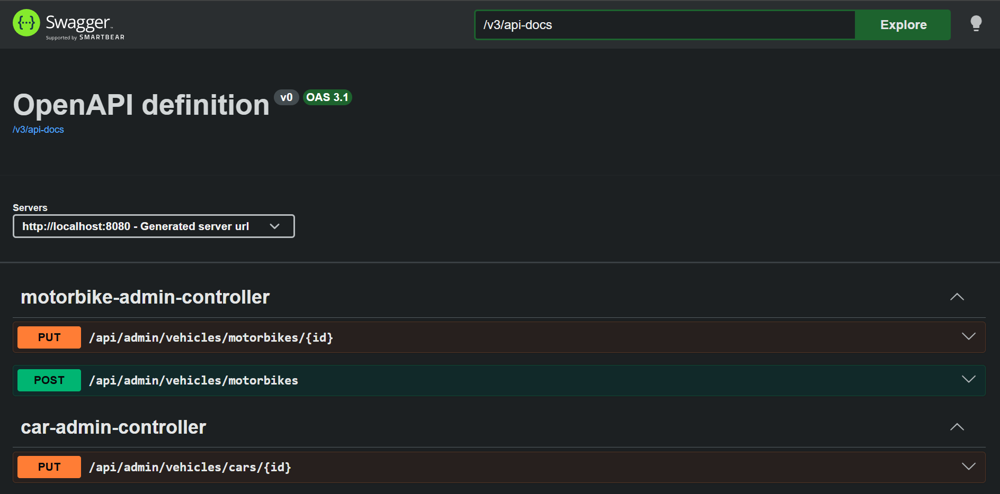
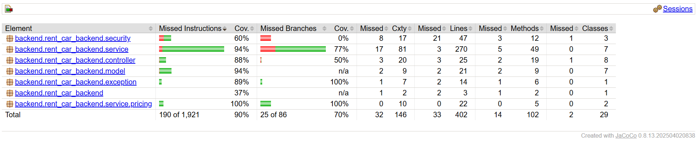
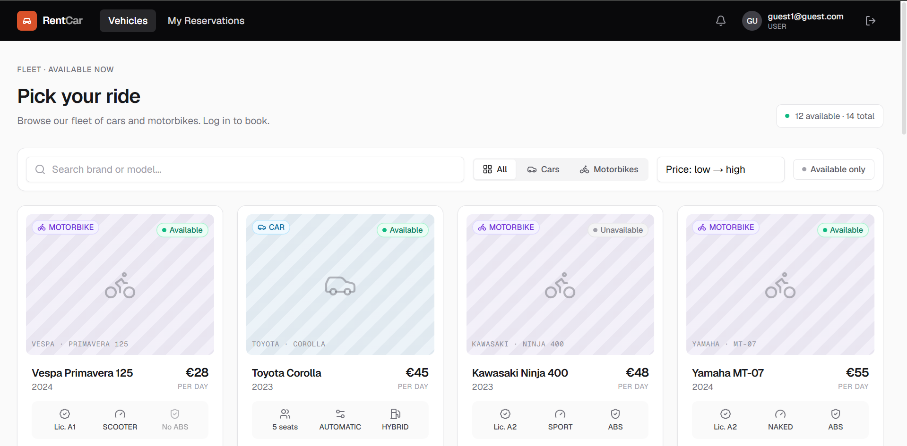
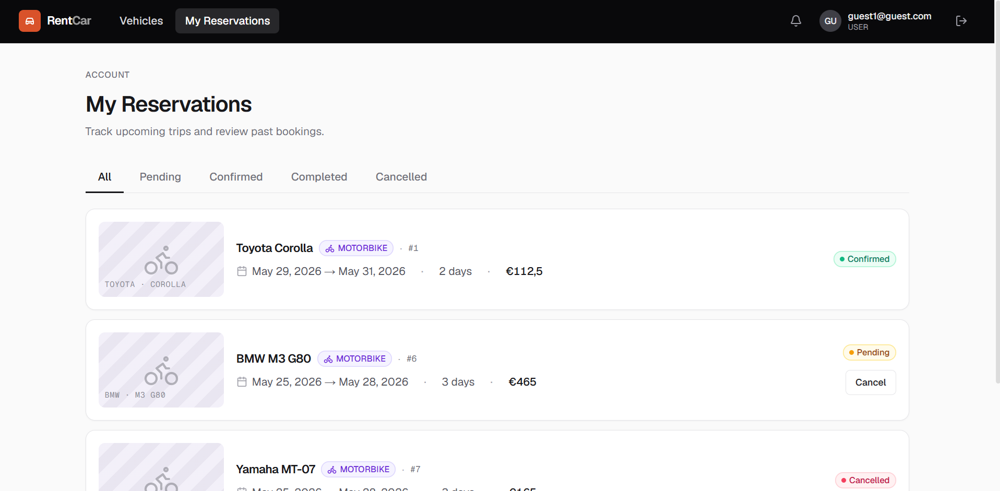
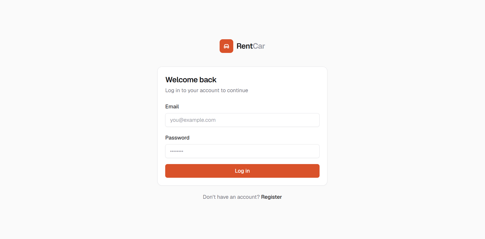
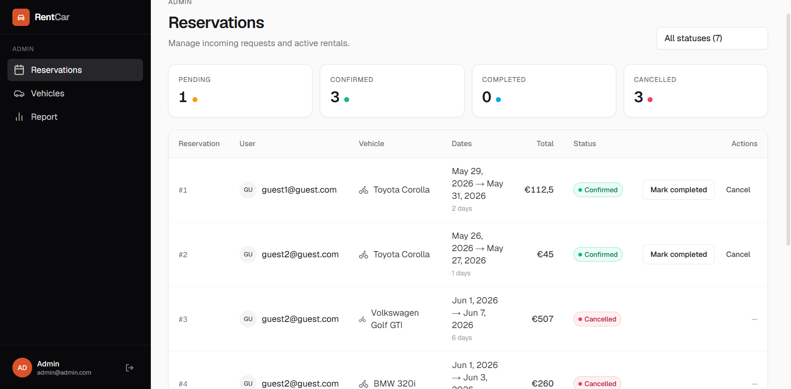

# rent-car

Full-stack project allowing you to manage the car renting process. From adding/modifying/deleting vehicles to managing reservations to allowing users to register and reserve cars. 

## Prerequisites

You just need **Docker** and **Docker Compose** to run everything 🤗

## Usage

`cd rent-car` - enter directory \
`cp .env.example .env` - create .env file \
In `.env` fill in:
- JWT_SECRET = generate using - `openssl rand -base64 32`
- DB_USERNAME = your choice
- DB_PASSWORD = your choice
- POSTGRES_PASSWORD = your choice

`docker compose up --build` - build projects

Then: \
`http://localhost:3000` - frontend \
`http://localhost:8080/swagger-ui.html` - backend API

App is fully self-sufficient though creating ADMIN accounts requires a direct sQL update on the `role` column!

## General description
#### Functionality

Car rental platform with **full reservation lifecycle management**. Users can **browse** available vehicles — cars and motorbikes — **filter** them by type and availability, **view** detailed specs and pricing, then **book** with a selected date range. Price is calculated automatically with weekend surcharge (1.5×). Reservations can be cancelled while still pending. Admins get a **dedicated panel to manage the entire vehicle fleet** (add, edit, delete cars and motorbikes), oversee all reservations and manually drive their status through a defined state machine. A **built-in report** shows per-vehicle revenue, reservation counts and rental day breakdowns, exportable as HTML.

#### Stack

Full-stack car rental platform. Frontend built with **Next.js 16** (TypeScript), styled with **Tailwind CSS** and **shadcn/ui** components, using **Zustand** for auth state and **React Query** for server state management. Authentication is handled via **JWT tokens** stored in httpOnly cookies through Next.js proxy routes. Backend powered by **Spring Boot 4** (Java 21) exposing a REST API secured with **Spring Security**. Data is persisted in **PostgreSQL** using **Hibernate/JPA** with JOINED table inheritance for the vehicle hierarchy. Database schema managed by **Flyway migrations**. All services containerized with **Docker Compose**. Heavily used **Claude Code** and **Claude Design** to help with each step of the project.

## API Endpoints

| Method | Path | Description |
|---|---|---|
| POST | `/api/auth/register` | Register new account |
| POST | `/api/auth/login` | Login, returns JWT |
| GET | `/api/vehicles` | List all vehicles (`?available=true`) |
| GET | `/api/vehicles/cars` | List all cars |
| GET | `/api/vehicles/cars/{id}` | Get car by id |
| GET | `/api/vehicles/motorbikes` | List all motorbikes |
| GET | `/api/vehicles/motorbikes/{id}` | Get motorbike by id |
| POST | `/api/reservations` | Create reservation |
| GET | `/api/reservations` | List own reservations |
| DELETE | `/api/reservations/{id}` | Cancel own PENDING reservation |
| GET | `/api/admin/reservations` | List all reservations |
| PUT | `/api/admin/reservations/{id}/status` | Update reservation status |
| POST | `/api/admin/vehicles/cars` | Create car |
| PUT | `/api/admin/vehicles/cars/{id}` | Update car |
| POST | `/api/admin/vehicles/motorbikes` | Create motorbike |
| PUT | `/api/admin/vehicles/motorbikes/{id}` | Update motorbike |
| DELETE | `/api/admin/vehicles/{id}` | Delete vehicle |
| GET | `/api/admin/report/vehicles` | Vehicle stats (revenue, reservation counts) |

## ERD Diagram of DB



## Project requirements 

#### Object-oriented + SOLID

The backend is structured around OOP principles throughout. `Vehicle` is an `abstract` class — you can never instantiate it directly, only `Car` or `Motorbike`. All state is encapsulated via private fields with Lombok-generated accessors.


```java
// Abstraction + Inheritance — Vehicle is abstract; Car and Motorbike extend it
@Entity
@Inheritance(strategy = InheritanceType.JOINED)
public abstract class Vehicle {
    private Long id;
    private String brand;
    private BigDecimal pricePerDay;
    private boolean available;
    // ...
}

@Entity
public class Car extends Vehicle {
    private int numSeats;
    private Transmission transmission;
    private FuelType fuelType;
}
```

```java
// Encapsulation — state is private; behaviour is exposed through methods
// ReservationService never touches vehicle fields directly
Vehicle vehicle = vehicleRepository.findById(req.getVehicleId());

if (!vehicle.isAvailable()) { ... }           // behaviour, not field access
BigDecimal price = vehicle.getPricePerDay();  // controlled access via getter
```

---

#### Admin and user functionality

Two roles exist: `USER` (default on register) and `ADMIN` (set via direct SQL). Spring Security enforces the separation — the entire `/api/admin/**` namespace requires `ROLE_ADMIN`:

```java
// SecurityConfig.java
.authorizeHttpRequests(auth -> auth
    .requestMatchers("/api/auth/**", "/swagger-ui/**", ...).permitAll()
    .requestMatchers(HttpMethod.GET, "/api/vehicles/**").permitAll()
    .requestMatchers("/api/admin/**").hasRole("ADMIN")
    .anyRequest().authenticated()
)
```

Users can: browse vehicles, book a vehicle, view their own reservations, cancel a PENDING reservation.  
Admins additionally can: add/edit/delete vehicles, view all reservations, change reservation status, download the revenue report.

The frontend enforces this too — Next.js middleware redirects non-admin users away from `/admin/**` before the page even renders.

---

#### Polymorphism

`Vehicle` is an abstract JPA entity. `Car` and `Motorbike` extend it using **JOINED table inheritance** — each has its own DB table, with `vehicle_type` as the discriminator column.

```java
// Vehicle.java
@Entity
@Inheritance(strategy = InheritanceType.JOINED)
@DiscriminatorColumn(name = "vehicle_type")
public abstract class Vehicle { ... }

// Car.java
@Entity
@DiscriminatorValue("CAR")
public class Car extends Vehicle {
    private int numSeats;
    private Transmission transmission;
    private FuelType fuelType;
}
```


---

#### Design pattern

**Strategy pattern** — `PricingStrategy` interface with two implementations:

```java
public interface PricingStrategy {
    BigDecimal calculate(LocalDate start, LocalDate end, BigDecimal pricePerDay);
}
```

`StandardPricingStrategy` — flat rate (all days × price).  
`WeekendPricingStrategy` — weekdays at normal rate, Saturday/Sunday at 1.5×. Marked `@Primary` so Spring injects it by default.

```java
@Component
@Primary
public class WeekendPricingStrategy implements PricingStrategy {
    private static final BigDecimal WEEKEND_MULTIPLIER = new BigDecimal("1.5");

    @Override
    public BigDecimal calculate(LocalDate start, LocalDate end, BigDecimal pricePerDay) {
        // iterates days, splits into weekday/weekend buckets, applies multiplier
    }
}
```

Swapping to a different pricing rule only requires changing which bean is `@Primary` — zero changes to `ReservationService`.

---

#### Git Repository

https://github.com/ArziPL/rent-car

Commits made regularly, and all of them signed with GPG.




---

#### Docker

Three services defined in `docker-compose.yml` at the repo root:

| Service | Image / Build | Port |
|---|---|---|
| `db` | `postgres:16` | 5432 |
| `backend` | built from `rent-car-backend/Dockerfile` | 8080 |
| `frontend` | built from `rent-car-frontend/Dockerfile` | 3000 |

```yaml
# docker-compose.yml (excerpt)
backend:
  build:
    context: ./rent-car-backend
  environment:
    SPRING_DATASOURCE_URL: jdbc:postgresql://db:5432/rentcar
    JWT_SECRET: ${JWT_SECRET}
  depends_on:
    db:
      condition: service_healthy

frontend:
  environment:
    BACKEND_URL: http://backend:8080   # internal Docker network
  depends_on:
    backend:
      condition: service_started
```

Backend uses a two-stage Dockerfile: Maven build stage → JRE runtime image. Frontend uses a three-stage Dockerfile: Node build → Next.js standalone output → minimal runtime image.

---

#### Maven

`pom.xml` defines the project — Spring Boot 4.0.6 parent, Java 21, and all dependencies:

```xml
<parent>
    <groupId>org.springframework.boot</groupId>
    <artifactId>spring-boot-starter-parent</artifactId>
    <version>4.0.6</version>
</parent>
<properties>
    <java.version>21</java.version>
</properties>
```

Key dependencies declared: `spring-boot-starter-data-jpa`, `spring-boot-starter-security`, `spring-boot-starter-webmvc`, `spring-boot-starter-flyway`, `springdoc-openapi-starter-webmvc-ui`, `postgresql`, `lombok`, `jjwt`, `spring-boot-starter-test` (JUnit 5 + Mockito).

---

#### Spring

Spring Boot 4 (Java 21) is the backbone of the entire backend:

- **Spring Web MVC** — REST controllers annotated with `@RestController`, `@GetMapping`, `@PostMapping` etc.
- **Spring Security** — stateless JWT filter chain, RBAC via `hasRole("ADMIN")`, BCrypt password hashing
- **Spring Data JPA** — repositories extend `JpaRepository<T, ID>`; custom JPQL queries for overlap detection and report aggregation
- **Spring Boot auto-configuration** — datasource, Flyway, transaction management wired up automatically from `application.properties`
- **Dependency Injection** — constructor injection via Lombok `@RequiredArgsConstructor` throughout; no field injection

```java
@RestController
@RequestMapping("/api/reservations")
@RequiredArgsConstructor
public class ReservationController {
    private final ReservationService reservationService;
    ...
}
```

---

#### Swagger UI

Springdoc OpenAPI (`springdoc-openapi-starter-webmvc-ui`) auto-generates the spec from controller annotations. Available at:

**`http://localhost:8080/swagger-ui.html`**


---

#### Hibernate + SQL

Database schema is managed by **Flyway** — 5 versioned migration scripts applied in order on startup:

| Migration | Table created |
|---|---|
| `V1__create_users_table.sql` | `users` |
| `V2__create_vehicles_table.sql` | `vehicles` |
| `V3__create_cars_table.sql` | `cars` |
| `V4__create_motorbikes_table.sql` | `motorbikes` |
| `V5__create_reservations_table.sql` | `reservations` |

Example migration:
```sql
-- V1__create_users_table.sql
CREATE TABLE users (
    id         BIGSERIAL PRIMARY KEY,
    email      VARCHAR(255) NOT NULL UNIQUE,
    password   VARCHAR(255) NOT NULL,
    role       VARCHAR(20)  NOT NULL DEFAULT 'USER',
    created_at TIMESTAMP    NOT NULL DEFAULT CURRENT_TIMESTAMP
);
```

---

#### JUnit + 80% test coverage

15 test classes covering controllers (MockMvc + `@WebMvcTest`) and services (Mockito unit tests):

```
src/test/java/
├── service/
│   ├── AuthServiceTest.java
│   ├── CarServiceTest.java
│   ├── MotorbikeServiceTest.java
│   ├── ReservationServiceTest.java
│   ├── ReportServiceTest.java
│   ├── VehicleServiceTest.java
│   ├── JwtServiceTest.java
│   └── PricingStrategyTest.java
└── controller/
    ├── AuthControllerTest.java
    ├── CarControllerTest.java
    ├── MotorbikeControllerTest.java
    ├── VehicleControllerTest.java
    ├── VehicleAdminControllerTest.java
    └── ReservationControllerTest.java
```

Exceeds the 80% requirement across all metrics.



---

#### README.md

You are reading one 😊

## License

MIT License

## Preview




