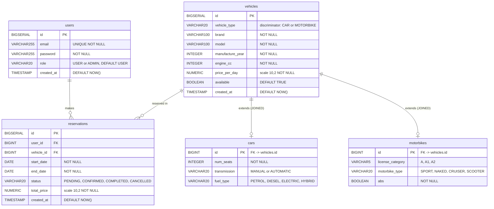

# Database ERD — RentCar

## Notes

| Concept | Detail |
|---|---|
| Inheritance | `vehicles` is the parent table. `cars` and `motorbikes` share the same `id` (PK = FK to `vehicles.id`). JPA `@Inheritance(strategy = JOINED)` with `vehicle_type` discriminator column. |
| `cars.id` | `BIGINT PRIMARY KEY REFERENCES vehicles(id)` — no separate sequence |
| `motorbikes.id` | Same pattern as `cars.id` |
| Reservation status | State machine: `PENDING -> CONFIRMED -> COMPLETED`; any non-CANCELLED -> `CANCELLED` (terminal) |
| Role values | `USER` (default on registration), `ADMIN` |
